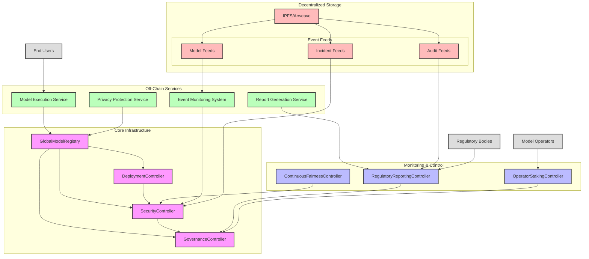

---

# VeritasVault AI/ML Architecture Canvas – Enhanced (with Critique)

> **AI/ML Pillar for DeFi – Security, Compliance, and Fairness**
>
> “Auditability and zero trust are not optional; if you can't explain or roll it back, it doesn't go to prod.”

---

## 1. Domain & Architectural Overview

* **Purpose:** A hexagonal/onion-driven domain model extending the Phoenix Market Data Platform with rigorously modular, upgradable AI/ML capability.
* **Context:** Designed for adversarial and high-regulatory environments—no place for black boxes, manual overrides, or weak controls.
* **Stack:** Controllers, Entities, CQRS, and Immutable Event Trails; Off-chain, on-chain, and hybrid integrations.

---

## 2. Responsibilities & Model Boundaries

### **Key Responsibilities (Refined)**

* Atomic model versioning, explicit dependency graphs, rollback-first design
* Security incident escalation, circuit breakers, and immutable audit trails
* Operator staking, deterministic slashing, on-chain cartel detection
* Continuous fairness/drift monitoring with intersectional bias analysis
* Shadow/canary/production deployment gating – **promotion only if all gates pass**
* Regulatory compliance and attestation as non-negotiable deployment gates

### **Entities, Value Objects, and Enums**

* **Entities:** ModelMetadata, ShadowDeployment, IncidentReport, OperatorStake, FairnessConfig, SlashingEvent, BacktestResult
* **Value Objects:** ModelIdentifier, FairnessMetric, OperatorRegion, DeploymentPhase
* **Enums:** ModelStatus, IncidentSeverity, ReportType

### **Core Controllers (with Critique Enhancements)**

* **GlobalModelRegistry:** Full versioning, dependency validation, health metrics, rollback
* **SecurityController:** Incident lineage validation, cryptographic proofs, ZK validation
* **GovernanceController:** Multi-region quorum, timelock, proposal/audit logs
* **ModelDeploymentController:** Gated deployments, rollback tested, simulation pipelines
* **ContinuousFairnessController:** Drift/bias/temporal/intersectional bias detection, auto-enforcement
* **RegulatoryReportingController:** Configurable, signed, immutable and exportable reports
* **OperatorStakingController:** Slashing, appeals, on-chain traceability, delegation with proofs

### **Repository Interfaces & CQRS**

* Command/query separation for all aggregates; explicit rollback contracts

### **Domain Events**

* ModelRegistered, DeploymentStatusChanged, IncidentReported, FairnessViolation, OperatorSlashed, ComplianceAttested

### **Project Structure (Best Practices Aligned)**

```
vv.Domain/AI/
├── Controllers/
├── Events/
├── Exceptions/
├── Models/
│   ├── Entities/
│   ├── ValueObjects/
│   └── Enums/
├── Repositories/
├── Services/
└── Specifications/
```

---

## 3. Infrastructure & Off-Chain Integration (Enhanced)

* **All dependencies must be explicit, versioned, and cryptographically proven.**
* **Atomic rollbacks are implemented at every pipeline stage.**
* **Fairness and compliance gates are hard stops, not suggestions.**
* **Monitoring:** Real-time health, dependency, and fairness dashboards

### **Architecture Flow Diagram (with Additions)**



---

## 4. Deep Dive: Critique-Informed Enhancements

### A. **Model Registry & Dependency Management**

* **Atomic Version Updates:** Deploys are all-or-nothing; rollback must be tested.
* **Dependency Graph:** No model can be deployed without validated, acyclic dependency trees.
* **Health Metrics:** Every model/dep tracks last validation, drift, and operational status.

```typescript
interface IEnhancedModelRegistry {
  createVersion(model: ModelMetadata, changes: ChangeSet, impact: ImpactAssessment): Promise<Version>;
  validateDependencyGraph(model: ModelMetadata, depth: number): Promise<ValidationResult>;
  getModelHealth(modelId: string, metrics: HealthMetrics[]): Promise<HealthReport>;
  rollbackModel(modelId: string, toVersion: string): Promise<RollbackResult>;
}
```

### B. **Fairness, Drift, and Enforcement**

* **Intersectional Bias:** Detects bias across protected attribute combinations.
* **Temporal Drift:** Tracks and alerts on time-based drift.
* **Enforcement:** Any violation blocks further promotion until resolved.

```typescript
interface IEnhancedFairnessController {
  detectIntersectionalBias(metrics: BiasMetrics, protectedAttributes: string[]): Promise<IntersectionalBiasReport>;
  trackTemporalDrift(modelId: string, timeWindow: TimeWindow): Promise<DriftAnalysis>;
  enforceGroupFairness(model: ModelMetadata, constraints: FairnessConstraints): Promise<EnforcementResult>;
}
```

### C. **Security & Formal Verification**

* **Cryptographic Lineage Proofs:** Every artifact/version is proven and signed.
* **ZK Integration:** Zero-knowledge proofs for execution correctness; no blind trust.
* **Formal Verification:** Property-based model property checks.

```typescript
interface IEnhancedSecurityController {
  validateModelLineage(model: ModelMetadata, proof: CryptographicProof): Promise<ValidationResult>;
  generateZKProof(model: ModelMetadata, execution: ModelExecution): Promise<ZKProof>;
  verifyModelProperties(model: ModelMetadata, properties: SecurityProperties[]): Promise<VerificationResult>;
}
```

### D. **Operator Staking, Slashing, and Delegation**

* **Deterministic Slashing:** Transparent, evidence-based, on-chain; must be reproducible.
* **Delegation:** Explicit on-chain delegation with cryptographic receipts.

```typescript
interface IOperatorStakingController {
  slash(operatorId: OperatorId, violation: ViolationType, evidence: Evidence): Promise<SlashingEvent>;
  delegate(from: OperatorId, to: OperatorId, amount: Stake): Promise<DelegationEvent>;
}
```

### E. **Compliance as a Gate, Not a Report**

* **Automated Regulatory Gating:** No deploy if compliance attestation fails.
* **Immutable Audit:** Every compliance action is logged, signed, and exportable.

```typescript
interface IRegulatoryReportingController {
  validate(model: ModelMetadata, regulations: Regulation[]): Promise<ComplianceStatus>;
  generateReport(modelId: ModelIdentifier, period: TimePeriod): Promise<ComplianceReport>;
}
```

---

## 5. Security, Threats, and Mitigation Map (Expanded)

| Threat              | Vector              | Mitigation/Control                                |
| ------------------- | ------------------- | ------------------------------------------------- |
| Model Poisoning     | Malicious update    | Multi-sig, canary/shadow, rollback required       |
| Model Extraction    | API scraping        | Rate limits, anomaly/cartel detection             |
| Drift/Bias          | Silent bias         | Live fairness monitoring, auto-enforcement        |
| Slashing Abuse      | False claims        | Evidence-based arbitration, public immutable logs |
| Cartel Formation    | Collusion           | Geo-diversity, random audits, stake randomization |
| Governance Capture  | Sybil/bribery       | Staking, weighted voting, timelock, multi-sig     |
| Shadow Model Escape | Data leak           | Isolation, no ext. writes                         |
| Regulatory Evasion  | Incomplete logs     | Immutable, cryptographically-signed audit trail   |
| API/Model DDoS      | Flooding            | Rate limits, circuit breakers                     |
| Privacy Breach      | Inference/ID attack | zkML, encryption, minimization                    |

---

## 6. Best Practices – Actionable and Auditable

1. **Atomic Model Versioning:** No partial deploys. All-or-nothing. Rollback tested before go-live.
2. **Dependency Validation:** No cycles, validated graphs, health tracked and surfaced.
3. **Fairness by Default:** Intersectional, temporal, and group bias checked at every stage.
4. **Audit-First:** All events/decisions are signed, hash-proven, and stored immutably.
5. **Geo-Diversity:** Operators distributed, no 33% region dominance, incentivized diversity.
6. **Circuit Breakers:** Tiered, auto-triggered by threat model—not “advisory.”

---

## 7. Implementation & Monitoring Guidelines

* All APIs and controllers versioned and auditable.
* Mandatory integration and regression tests for cross-domain scenarios.
* Continuous pen-testing of incident/rollback/fairness gates.
* Real-time dashboards for model health, drift, fairness, operator events, and compliance.

---

## 8. System Guarantees (What Actually Matters)

* **Security:** Multi-layer, cryptographically enforced, no manual overrides.
* **Compliance:** Regulatory-aligned, attestation and reporting as pre-deploy gates.
* **Performance:** Fail-safe, rollbacks tested, everything monitored.
* **Governance:** Decentralized, multi-region, traceable, and auditable.

---

## 9. Reference Table: Artifact–Spec Alignment

| Layer                 | Example Artifact | Core Spec / Interface          |
| --------------------- | ---------------- | ------------------------------ |
| Domain Entities       | ModelMetadata    | IEnhancedModelRegistry         |
| Security/Incident     | IncidentReport   | IEnhancedSecurityController    |
| Governance            | ModelAuditLog    | IModelGovernanceController     |
| Deployment            | ShadowDeployment | IModelDeploymentController     |
| Fairness              | FairnessConfig   | IEnhancedFairnessController    |
| Regulatory Compliance | ComplianceReport | IRegulatoryReportingController |
| Operator Staking      | OperatorStake    | IOperatorStakingController     |

---

## 10. Next Steps (Critical Path)

1. Implement atomic, cryptographically proven versioning and dependency tracking
2. Integrate ZK proofs and formal verification into SecurityController
3. Elevate fairness enforcement to intersectional/group/temporal coverage—blocking, not advisory
4. Ensure regulatory/compliance gating is fully integrated into the main deployment pipeline
5. Harden dashboards, regression, and incident/rollback automation

---

## 11. Final Assessment

> This design is tough, but the threat model is tougher. If versioning isn’t atomic, fairness isn’t enforced, or compliance isn’t a gate—**the whole system is a liability.**
>
> "If it can’t be rolled back, explained, or proven, it doesn’t go live. Period."

---
