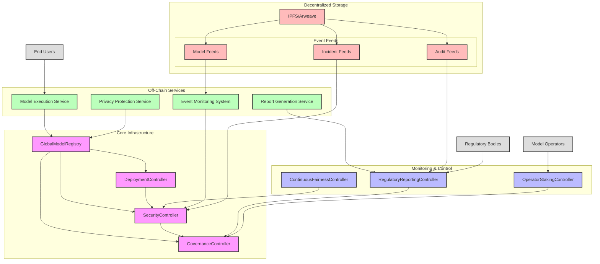

# AI/ML Architecture

> AI/ML Pillar for DeFi—Security, Compliance, and Fairness

## 1. Overview

This architecture is a hexagonal/onion-inspired domain model built to extend the Phoenix Market Data Platform. It layers in rigorous AI/ML capabilities with institutional governance, regulatory compliance, economic security, and advanced monitoring. Everything is modular, upgradable, and built for hostile environments. If you want "throw it in prod and hope" — look elsewhere.

## 2. Domain Model & Layered Responsibilities

### Key Responsibilities

- Model metadata, versioning, and dependency management
- Security incident tracking and escalation
- Operator staking, slashing, and cartel detection
- Fairness monitoring and regulatory reporting
- Shadow/canary deployments and production promotion
- Immutable audit, event, and compliance reporting

### Entities, Value Objects, Enums

- **Entities:** ModelMetadata, ShadowDeployment, BacktestResult, IncidentReport, FairnessConfig, OperatorStake, SlashingEvent
- **Value Objects:** ModelIdentifier, FairnessMetric, OperatorRegion, DeploymentPhase
- **Enums:** ModelStatus, IncidentSeverity, ReportType

### Core Controller Interfaces

**GlobalModelRegistry** - Central source of truth for all model artifacts, versions, and dependency graphs.

```solidity
interface IGlobalModelRegistry { /* see full spec below */ }
```

**SecurityController** - Incident management, escalation, circuit breakers, emergency rollback.

```solidity
interface IModelSecurityController { /* see full spec below */ }
```

**GovernanceController** - Protocol and operator governance, audit logs, quorum/region checks.

```solidity
interface IModelGovernanceController { /* see full spec below */ }
```

**ModelDeploymentController** - Shadow/canary/prod deployments, backtesting, promotion.

```solidity
interface IModelDeploymentController { /* see full spec below */ }
```

**ContinuousFairnessController** - Live monitoring, drift detection, auto-response for bias/fairness violations.

```solidity
interface IContinuousFairnessController { /* see full spec below */ }
```

**RegulatoryReportingController** - Configurable, signed, exportable reports for regulators and operators.

```solidity
interface IRegulatoryReportingController { /* see full spec below */ }
```

**OperatorStakingController** - Manages operator registration, slashing, appeals, and cartel detection.

```solidity
interface IOperatorStakingController { /* see full spec below */ }
```

### Repository Interfaces & CQRS

- Separate Commands and Queries for all core entities
- Clean interface separation for ease of testing, upgrades, and security

### Domain Events

ModelRegisteredEvent, ModelDeploymentStatusChangedEvent, SecurityIncidentReportedEvent, FairnessViolationDetectedEvent, OperatorSlashedEvent, etc.

### Project Structure

```swift
vv.Domain/AI/
├── Controllers/
├── Events/
├── Exceptions/
├── Models/
│   ├── Entities/
│   ├── ValueObjects/
│   └── Enums/
├── Repositories/
├── Services/
└── Specifications/
```

## 3. Core Infrastructure & Off-Chain Integration

### Architecture Flow



## 4. Component Deep Dive

### Solidity/TypeScript Interface Highlights

Full code specs for each controller/contract are above—see previous section for example interfaces and details.

### Deployment, Monitoring, & Compliance Phases

#### Phase 1: Core (Weeks 1-3)

- Deploy GlobalModelRegistry with versioning and dependency tracking
- Implement base ModelDeploymentController for initial deployment pipeline
- Establish core monitoring infrastructure
- Deploy core objects and events:
  - Objects: ModelMetadata, ModelVersion, ModelDependency, ModelArtifact, ModelExecutionConfig
  - Events: ModelRegistered, ModelVersionCreated, DependencyAdded, ArtifactUploaded, ConfigUpdated

#### Phase 2: Security & Incident Response (Weeks 4-6)

- Deploy SecurityController with incident management workflow
- Implement escalation procedures and circuit breakers
- Establish rollback mechanisms and security policies
- Deploy additional objects and events:
  - Objects: IncidentReport, SecurityPolicy, CircuitBreaker, RollbackRecord, SecurityEscalation
  - Events: IncidentReported, IncidentEscalated, CircuitBreakerTriggered, ModelRolledBack, SecurityPolicyEnforced

#### Phase 3: Governance & Audit (Weeks 7-9)

- Deploy GovernanceController with multi-sig and timelock capabilities
- Implement ContinuousFairnessController with bias monitoring
- Establish comprehensive audit logging system
- Deploy additional objects and events:
  - Objects: ModelAuditLog, GovernanceProposal, FairnessConfig, FairnessMetric, JurisdictionValidation
  - Events: AuditLogCreated, ProposalCreated, ProposalExecuted, FairnessViolationDetected, MetricUpdated, JurisdictionValidated

#### Phase 4: Privacy, Streaming, & Operator Security (Weeks 10-12)

- Deploy OperatorStakingController with slashing mechanisms
- Implement RegulatoryReportingController with compliance reports
- Establish IPFS/Arweave integration for decentralized storage
- Deploy advanced objects and events:
  - Objects: OperatorStake, SlashingEvent, Appeal, RegulatoryReport, PrivacyConfig, StreamingEvent
  - Events: OperatorRegistered, OperatorSlashed, AppealFiled, AppealResolved, ReportGenerated, PrivacyEnforced, EventStreamed

## Security Architecture

The AI/ML security architecture implements multiple layers of protection:

1. **Model Security**:
   - Dependency validation before deployment
   - Input sanitization for all model operations
   - Output verification and reasonableness checks
   - Resource isolation between models

2. **Operational Security**:
   - Regular key rotation for all components
   - Comprehensive incident response procedures
   - Immutable audit trails for all operations
   - Granular access control for all components

3. **Governance Security**:
   - Multi-signature requirements for critical actions
   - Timelock enforcement for governance changes
   - Defined emergency procedures with verification
   - Operator diversity to prevent centralization

4. **Fairness Security**:
   - Protected attribute encryption using homomorphic techniques
   - Bias detection with statistical confidence intervals
   - Drift monitoring with robust anomaly detection
   - Response automation with human verification

5. **Economic Security**:
   - Multi-signature requirements for stake management
   - Formal verification of slashing conditions
   - Transparent and provable cartel detection
   - Fair and impartial appeal mechanism

## 5. Security, Threats, & Mitigation Map

| Threat Type             | Vector                      | Mitigation                                     |
| ----------------------- | --------------------------- | ---------------------------------------------- |
| **Model Poisoning**     | Malicious update/data       | Multi-sig approval, shadow/canary deploys      |
| **Model Extraction**    | API scraping, collusion     | Rate limits, anomaly/cartel detection          |
| **Drift/Bias**          | Silent drift, bias          | Continuous fairness, auto-alerts, rollback     |
| **Slashing Abuse**      | False claims                | Evidence-based arbitration, public audit trail |
| **Cartel Formation**    | Operator collusion/bribes   | Geo distribution, random audits, rotation      |
| **Governance Capture**  | Sybil/DAO bribery           | Staking, identity, weighted voting, timelock   |
| **Shadow Model Escape** | Data leak                   | Isolation, no external writes                  |
| **Regulatory Evasion**  | Incomplete logs             | Immutable trails, regulator keys               |
| **API/Model DDoS**      | Flooding                    | Rate limiting, circuit breakers, quotas        |
| **Privacy Breach**      | Inference/re-identification | zkML, encryption, data minimization            |

## 6. Best Practices

1. **Model Versioning**: SemVer, no breaking changes without major bump.
2. **Dependency Tracking**: Validate all dependencies before deploy. No cycles.
3. **Fairness by Design**: Define metrics before deploy; regular audits; prove impact.
4. **Audit Trails**: All decisions logged, hash-proven, and cryptographically signed.
5. **Geographic Diversity**: Operators in 5+ regions; no >33% dominance.
6. **Circuit Breakers**: Predefined triggers, auto-pause, escalation on violation.

## 7. Implementation Guidelines & References

- AI/ML Implementation Guidelines
- Controller Interfaces
- Security Guidelines
- Deployment Strategy

## 8. Integration with Market Data

- AI models consume, validate, and feedback into the market data pipeline.
- Anomaly detection in AI triggers data re-verification.
- All flows are audited, versioned, and traceable.

## 9. Quality, Monitoring, and Alerts

- Continuous performance, fairness, and compliance monitoring
- Immutable, cryptographically-verifiable logs
- Automated and manual escalation for critical events

## 10. System Guarantees

- **Security**: Multi-layer, cryptographically-enforced, fully auditable
- **Compliance**: Regulatory-aligned, report-ready, with proofs
- **Performance**: Scalable, monitored, fail-safe
- **Governance**: Decentralized, diverse, transparent

All dependencies point inwards (onion/hex architecture).

## Summary Table: Artifact References

| Layer                 | Example Artifact | Core Spec / Interface Example  |
| --------------------- | ---------------- | ------------------------------ |
| Domain Entities       | ModelMetadata    | IGlobalModelRegistry           |
| Security/Incident     | IncidentReport   | IModelSecurityController       |
| Governance            | ModelAuditLog    | IModelGovernanceController     |
| Deployment            | ShadowDeployment | IModelDeploymentController     |
| Fairness              | FairnessConfig   | IContinuousFairnessController  |
| Regulatory Compliance | ModelReport      | IRegulatoryReportingController |
| Operator Staking      | OperatorStake    | IOperatorStakingController     |

## Best Practices

1. **Model Versioning**:
   - All models must be explicitly versioned
   - Semantic versioning (MAJOR.MINOR.PATCH)
   - Compatibility requirements clearly defined
   - Breaking changes require new MAJOR version

2. **Dependency Tracking**:
   - All model dependencies must be registered
   - Complete dependency graph must be validated before deployment
   - Circular dependencies are prohibited
   - Cascading updates for critical security fixes

3. **Fairness by Design**:
   - Fairness metrics must be defined before deployment
   - Regular audits against protected attributes
   - Documentation of fairness considerations
   - Impact assessments for model changes

4. **Audit Trails**:
   - All model decisions must be explainable and auditable
   - Cryptographic proof of decision inputs and outputs
   - Immutable storage of significant decisions
   - Configurable retention policies

5. **Geographic Diversity**:
   - Operators must be distributed across jurisdictions
   - No single region can exceed 33% control
   - Diversity incentives for underrepresented regions
   - Regular rotation of validation responsibilities

6. **Circuit Breakers**:
   - All models must have predefined circuit breaker conditions
   - Automatic suspension for critical violations
   - Tiered response based on severity
   - Formal verification of circuit breaker logic

## Implementation Resources

For detailed implementation guidelines, refer to:

- [AI/ML Implementation Guidelines](./IMPLEMENTATION.md) - Comprehensive implementation process
- [Controller Interfaces](./Controllers/IModelController.cs) - Core interface definitions
- [Security Guidelines](./Security/GUIDELINES.md) - Security best practices
- [Deployment Strategy](./Deployment/STRATEGY.md) - Phased deployment approach
