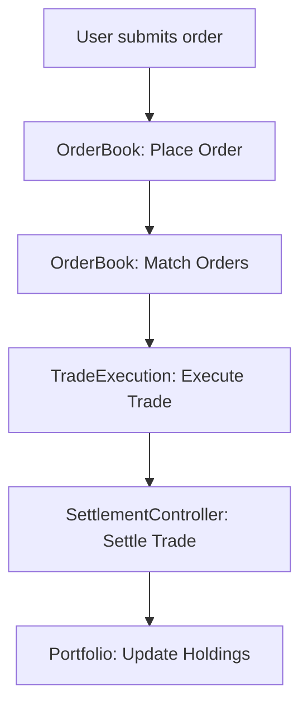

# VeritasVault Artifact 3 – Asset, Trading & Settlement Domain

---

# 1. Metadata Block

```yaml
---
document_type: architecture
classification: internal
status: draft
version: 1.0.0
last_updated: YYYY-MM-DD
applies_to: asset-trading-settlement-domain
dependencies: [core-infrastructure, risk-compliance-audit, ai-ml-domain]
reviewers: [product-lead, trading-lead, settlement-lead, security-lead]
next_review: YYYY-MM-DD
priority: p0
---
```

---

# 2. Executive Summary

## Business Impact

* Enables asset issuance, trading, settlement, and liquidity management—core revenue and utility drivers for the protocol.
* Provides the mechanisms for decentralized markets, portfolio creation, and protocol-level financial innovation.
* MVP is mandatory for any user or institutional adoption.

## Technical Impact

* Introduces standardized asset model, trade matching, settlement finality, and liquidity pool mechanics.
* MVP will establish deterministic, auditable, and secure trade settlement flows.
* Integrates with Risk, Audit, and Core Infra for end-to-end event and compliance handling.

## Timeline Impact

* **Phase 1 (MVP):** Asset model, portfolio, orderbook, and basic trade execution.
* **Phase 2:** Liquidity pools, provider logic, and multi-asset portfolio support.
* **Phase 3:** Advanced settlement, cross-chain swaps, and on-chain liquidity optimization.
* **Phase 4:** Production-grade scale-out, performance tuning, and secondary market features.

---

# 3. Domain Overview

The Asset, Trading & Settlement domain underpins all financial activity on VeritasVault—handling asset representation, decentralized trading, and the secure settlement of every order and transaction. This domain ensures all trades are transparent, auditable, and atomic.

---

# 4. Responsibilities & Boundaries

## Core Functions

* Asset creation, metadata management, and lifecycle tracking
* Trade matching (orderbook), validation, and execution
* Portfolio and liquidity management
* Settlement finality and event emission
* Integration with risk scoring and audit logging

## Scope Definition

* **In Scope:**

  * Asset, Portfolio, OrderBook, TradeExecution, SettlementController, LiquidityPool, LiquidityProvider (MVP prioritizes Asset, Portfolio, OrderBook, TradeExecution, SettlementController)
* **Out of Scope:**

  * Custody and treasury (handled by Governance & Ops), protocol upgrade logic, external exchange bridges (future phases)

---

# 5. Domain Model Structure (DDD, MVP Focus)

## Aggregate Roots

* **Portfolio:** Aggregates all assets held by a user or contract; lifecycle and value tracking.
* **OrderBook:** Aggregates all open, matched, and historical orders for a given asset or pair.
* **Settlement:** Aggregates state and lifecycle for each completed trade and cross-chain swap.

## Entities

* **Asset:** Canonical representation of any token or instrument.
* **Trade:** Executed trade record—links buyer, seller, asset, quantity, and price.
* **LiquidityProvider:** Entity managing contributed liquidity and rewards.
* **LiquidityPool:** Pool logic, reserves, and trading formulas (Phase 2+).

## Value Objects

* **Order:** Immutable request to buy/sell; used in orderbook and trade validation.
* **SettlementResult:** Result of a completed settlement, including confirmation details.
* **AssetMeta:** Token metadata, decimals, issuer, etc.

## Domain Events

* **PortfolioUpdated:** Portfolio balance or value changes.
* **AssetListed:** New asset/token created and listed.
* **OrderMatched:** Successful trade match in the orderbook.
* **TradeExecuted:** Trade finalized and settled.
* **LiquidityAdded:** New liquidity contributed (Phase 2+).
* **SettlementFinalized:** On-chain/cross-chain settlement complete.

## Repository Contracts

* **IPortfolioRepository:** Query, update, and audit portfolio state.
* **IOrderBookRepository:** Query, match, and archive orders.
* **ISettlementRepository:** Track settlement state and finality.
* **IAssetRepository:** CRUD for assets and their metadata.
* **ILiquidityPoolRepository:** Manage pools and LP participation (Phase 2+).

## Invariants / Business Rules

* No asset/trade exists without a valid on-chain or signed audit trail.
* All trades must be matched via deterministic orderbook rules (no hidden order flow).
* Settlement is atomic and cannot be reversed except by on-chain governance.
* Liquidity can only be withdrawn after minimum holding periods (Phase 2+).

---

# 6. MVP Interfaces (TypeScript Example)

```typescript
interface IAsset {
    mint(to: Address, amount: uint256): Promise<void>;
    burn(from: Address, amount: uint256): Promise<void>;
    getMeta(): Promise<AssetMeta>;
}

interface IOrderBook {
    placeOrder(order: Order): Promise<OrderId>;
    matchOrders(): Promise<Trade[]>;
    cancelOrder(orderId: OrderId): Promise<void>;
}

interface ITradeExecution {
    executeTrade(buyOrder: Order, sellOrder: Order): Promise<Trade>;
    settleTrade(trade: Trade): Promise<SettlementResult>;
}

interface IPortfolio {
    getHoldings(address: Address): Promise<Asset[]>;
    updateHoldings(address: Address, asset: Asset, delta: int256): Promise<void>;
}
```

---

# 7. Example Workflow (MVP)



---

# 8. Integration Points

* Risk domain triggers (for trade validation, compliance checks)
* Core infra hooks (block finalization, index events)
* Audit log emission (all trades and settlements)

---

# 9. Document Control

* **Owner:** Trading & Settlement Architect
* **Last Reviewed:** YYYY-MM-DD
* **Change Log:** Initial MVP focus, DDD mapping, interfaces
* **Next Review:** YYYY-MM-DD

---
