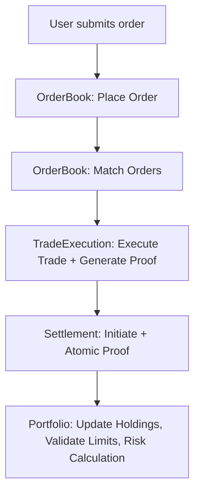

---

# VeritasVault Artifact 3 – Asset, Trading & Settlement Domain (Phase 1 – MVP, Revised)

---

## 1. Overview

This domain defines all asset management, trading, and settlement logic for VeritasVault. **Design is explicitly institution-grade**: composability, auditability, and atomicity are non-negotiable.
Liquidity pools, LP rewards, and AMM are **deferred to Phase 2+**. "Move fast and break things" is not just discouraged—it’s actively architected out.

---

## 2. Domain Model & Responsibilities

### A. Asset & Portfolio Domain (Phase 1 Focus)

#### Portfolio (Aggregate Root)

* Multi-asset basket manager for portfolio construction, value, and position limits
* Manages all open/closed positions by reference (ID only)
* Tracks historical and real-time performance, supports deterministic rebalancing
* **Validates position/risk limits, calculates risk metrics, and exposes audit trails**

#### Asset (Entity)

* Canonical asset representation with full metadata provenance, verification, and hash proofs
* Controls lifecycle (creation, state transitions, multi-sig governance for changes)
* Enforces compliance, permission, and regulatory constraints
* **All metadata/state transitions must be cryptographically verified**

#### Trade (Entity)

* Executed trade record (never aggregate root)
* Links buyer, seller, asset, quantity, price, settlementId (IDs only)
* **Trade proof generated for every execution; compliance validation required**

#### OrderBook (Aggregate Root)

* Manages deterministic order matching (strict FIFO/price-time)
* Tracks full order history and state (priority queues, depth at every price, real-time metrics)
* Exposes audit trails and matching efficiency metrics
* **All matching must be auditable and metrics exportable**

#### Settlement (Aggregate Root)

* Manages lifecycle of completed trades/settlements, tracks by tradeId
* Guarantees atomic, auditable settlement—**rollback only by explicit, auditable governance**
* Supports batch and atomic multi-settlement with cryptographic proofs

### Value Objects

* **Order:** Immutable buy/sell request
* **SettlementResult:** Atomic, cryptographically proven
* **AssetMeta:** Immutable, hash-verified token metadata

### Key Domain Events (Phase 1)

* AssetCreated, AssetListed, AssetStatusChanged, AssetMetadataVerified
* PortfolioCreated, PortfolioUpdated, PortfolioLimitBreached, PortfolioRebalanced
* OrderPlaced, OrderMatched, OrderDepthChanged, TradeExecuted, TradeProofGenerated
* SettlementInitiated, SettlementFinalized, AtomicSettlementProofGenerated

---

## 3. Implementation Patterns (Revised)

### Core Interfaces (Solidity/TypeScript)

```typescript
interface IEnhancedAsset {
  mint(to: Address, amount: uint256): Promise<void>;
  burn(from: Address, amount: uint256): Promise<void>;
  getMeta(): Promise<AssetMeta>;
  verifyMetadata(meta: AssetMeta, proof: MetadataProof): Promise<VerificationResult>;
  transitionState(newState: AssetState, auth: StateTransitionAuth): Promise<TransitionResult>;
}

interface IEnhancedOrderBook {
  placeOrder(order: Order): Promise<OrderId>;
  matchOrders(version: number, optimisticLock: string): Promise<[Trade[], string]>;
  cancelOrder(orderId: OrderId): Promise<void>;
  getPriorityQueue(side: OrderSide, price: BigNumber): Promise<Order[]>;
  getDepthAtPrice(asset: AssetId, price: BigNumber): Promise<OrderBookDepth>;
  getMatchingMetrics(window: TimeWindow): Promise<MatchingMetrics>;
}

interface IEnhancedTradeExecution {
  executeTrade(buy: Order, sell: Order): Promise<Result<Trade>>;
  settleTrade(trade: Trade): Promise<SettlementResult>;
  validateTradeCompliance(trade: Trade, compliance: ComplianceRules): Promise<ValidationResult>;
  generateTradeProof(trade: Trade, exec: ExecutionDetails): Promise<TradeProof>;
}

interface IEnhancedPortfolio {
  getHoldings(address: Address): Promise<Asset[]>;
  updateHoldings(address: Address, asset: Asset, delta: int256): Promise<void>;
  validatePositionLimits(address: Address, asset: Asset, amt: BigNumber): Promise<ValidationResult>;
  rebalancePortfolio(address: Address, target: PortfolioTarget): Promise<RebalanceResult>;
  calculatePortfolioRisk(address: Address, metrics: RiskMetrics[]): Promise<RiskReport>;
}

interface IEnhancedSettlement {
  initiateSettlement(tradeId: TradeId): Promise<SettlementResult>;
  finalizeSettlement(settlementId: SettlementId): Promise<void>;
  atomicSettleWithProof(settlement: Settlement, proof: SettlementProof): Promise<AtomicSettlementResult>;
  batchSettle(settlements: Settlement[], batchProof: BatchProof): Promise<BatchSettlementResult>;
  verifySettlementChain(settlementId: SettlementId): Promise<VerificationResult>;
}

interface ITradingRiskControls {
  validatePreTrade(order: Order, ctx: TradingContext): Promise<ValidationResult>;
  verifyExecution(trade: Trade, proof: ExecutionProof): Promise<VerificationResult>;
  checkCircuitBreakers(asset: Asset, metrics: MarketMetrics): Promise<CircuitBreakerStatus>;
}
```

---

## 4. Responsibilities, Boundaries & Invariants (Strengthened)

* **Portfolio:** Holds only IDs, validates all position/risk constraints, never directly manipulates trades or settlements.
* **OrderBook:** Strictly manages matching/state, never references portfolios or settlements, exposes queue/depth metrics.
* **Settlement:** Independent, atomic, and cryptographically proven. Only governance can rollback. Batch/atomic operations must be audit-proven.
* **Trade:** Links by ID only, generates proof on every execution, requires compliance validation before settlement.
* No asset/trade exists without a signed, immutable, and auditable trail.
* All matching and settlement must be deterministic, exportable, and **metrics made available for audit**.
* Concurrency: All matching/order updates use optimistic locking/versioning.

---

## 5. Example Workflow (Revised)



---

## 6. Integration Points (Phase 1)

* Risk domain triggers (trade validation, compliance, circuit breakers)
* Core infrastructure (block finalization, event index)
* Audit log emission (all trades, settlements, asset state changes, proofs)
* Observability: trading metrics, order book depth, execution/settlement latency, risk metrics, portfolio limit breaches

---

## 7. Best Practices (Revised)

* **Composability:** All contracts modular and upgradeable; no hard-coded dependencies.
* **Deterministic/Auditable:** All matching/settlement rules are deterministic, auditable, and metrics exportable.
* **Atomic Operations:** All state updates are atomic and revert on any error—batch ops must prove atomicity.
* **Lifecycle Tracking:** All objects versioned and referenceable, all state transitions hash-proven.
* **Error Management:** Comprehensive error/result objects, context on every failure.
* **Event Sourcing:** Events drive all cross-aggregate comms and recovery.
* **Concurrency:** Optimistic locking/versioning required on all matchings, rebalances, settlements.
* **Circuit Breakers:** Systemic checks at risk/trade/settlement layers, auto-triggered, exportable status.

---

## 8. Security & Threat Considerations (Strengthened)

| Threat Type              | Scenario                     | Mitigation                                            |
| ------------------------ | ---------------------------- | ----------------------------------------------------- |
| Trade Manipulation       | Frontrunning, order spoofing | Deterministic matching, audit trail, circuit breakers |
| OrderBook Corruption     | Spam/cancellation attacks    | Rate limits, signature/circuit breaker checks         |
| Asset Metadata Tampering | Supply/decimals fraud        | Metadata hash, multi-sig and hash verification        |
| Settlement Failure       | Chain reorg, batch errors    | Finality proofs, batch atomicity, audit logs          |
| Portfolio Breach         | Limit/risk overexposure      | Pre/post validation, limit enforcement, risk checks   |
| Compliance Violation     | Trade without compliance     | Pre-trade validation, proof-required for settlement   |

---

## 9. References & Document Control

* **Domain Owner:** Trading & Settlement Architect
* **Last Reviewed:** 2025-05-24
* **Change Log:** Major revision for DDD, atomic ops, compliance, circuit breakers, and risk management
* **Next Review:** 2025-07-01

### Reference Specs

* Asset Model, OrderBook, Trade, Settlement, Portfolio, Risk Controls, and relevant interfaces

---

\*Liquidity pool logic, LP rewards, and AMM/advanced trading are **deferred to Phase 2+.**
*If you need code separation, workflow expansion, or further aggregate boundary breakdown, just say so.*
