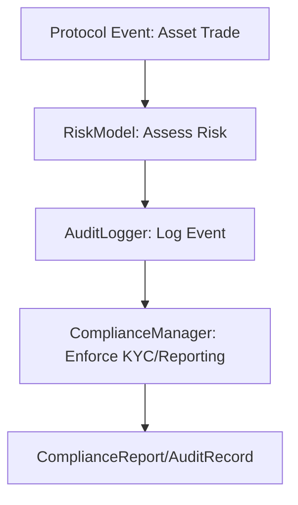

# VeritasVault Artifact 2 – Risk, Compliance & Audit Domain

---

# 1. Metadata Block

```yaml
---
document_type: architecture
classification: internal
status: draft
version: 1.0.0
last_updated: YYYY-MM-DD
applies_to: risk-compliance-audit-domain
dependencies: [core-infrastructure, asset-trading-settlement, ai-ml-domain]
reviewers: [risk-lead, compliance-lead, audit-lead, security-lead]
next_review: YYYY-MM-DD
priority: p0
---
```

---

# 2. Executive Summary

## Business Impact

* Ensures institutional-grade risk management, compliance, and audit trails for all VeritasVault activity.
* Enables regulatory onboarding, reputation protection, and incident response.
* Mandatory for DeFi adoption by traditional finance and regulated institutions.

## Technical Impact

* Real-time risk assessment, immutable audit logging, and event-driven compliance reporting.
* Cross-domain event hooks for infrastructure, asset/trade, and governance events.
* Modular DDD structure for safe extension and regulatory change.

## Timeline Impact

* Phase 1 MVP: RiskModel, AuditLogger, minimal ComplianceManager (KYC/AML, reporting), core event hooks.
* Phase 2: Advanced risk analytics, deeper compliance automation, enhanced reporting.
* Phase 3: Full regulator integration, real-time analytics, automated dispute resolution.
* Phase 4: Cross-chain and AI-driven risk/compliance modules.

---

# 3. Domain Overview

The Risk, Compliance & Audit domain is the protocol’s nerve center for risk controls, compliance enforcement, and full event traceability. All major protocol actions are logged, scored, and, if necessary, escalated for compliance and response.

---

# 4. Responsibilities & Boundaries

## Core Functions

* Risk profile management and real-time risk scoring
* Immutable event/audit logging
* Regulatory compliance enforcement (KYC/AML, basic reporting)
* Protocol-wide incident and escalation hooks
* Exportable audit and compliance records

## Scope Definition

* **In Scope:**

  * RiskModel, AuditLogger, ComplianceManager, risk scoring/reporting, KYC/AML, audit trail, core cross-domain events
* **Out of Scope:**

  * Advanced analytics, third-party regulator integration, dispute automation, AI-driven risk (future phase)

---

# 5. Domain Model Structure (DDD)

## MVP Subset Table

| Component         | In MVP | Out (Future Phase) |
| ----------------- | ------ | ------------------ |
| RiskModel         | ✓      |                    |
| AuditLogger       | ✓      |                    |
| ComplianceManager | ✓      | Advanced Policy    |
| RiskProfile       | ✓      |                    |
| AuditRecord       | ✓      |                    |
| ComplianceReport  | ✓      | Advanced Reporting |
| RiskFactor        |        | ✓                  |
| DisputeEngine     |        | ✓                  |
| AI/ML Analytics   |        | ✓                  |

## Aggregate Roots

* **RiskProfile:** Aggregates risk assessments, scoring, escalation state.
* **AuditRecord:** Aggregates all audit trail events and links to protocol state.
* **ComplianceCase:** Aggregates KYC/AML status, compliance actions, and reporting.

## Entities

* **RiskAssessment:** Individual event or transaction risk score.
* **ComplianceReport:** Periodic or ad-hoc compliance output.
* **AuditEntry:** Immutable event log record.

## Value Objects

* **RiskScore:** { type, value, confidence, timestamp }
* **ComplianceRule:** Configurable compliance trigger or rule.
* **Signature:** Cryptographic proof for audit entries.

## Domain Events

* **RiskAssessed:** Risk profile updated/triggered.
* **AuditLogAppended:** New audit entry created.
* **ComplianceReportGenerated:** Compliance status/report issued.
* **IncidentEscalated:** Protocol incident requiring review.

## Repository Contracts

* **IRiskProfileRepository:** Manage aggregate lifecycle and scoring.
* **IAuditRecordRepository:** Manage immutable audit trails.
* **IComplianceCaseRepository:** Track compliance state and reporting.

## Invariants / Business Rules

* No protocol state change without audit entry.
* Every transaction/event receives risk score.
* No compliance case closes without full KYC/AML check.
* Audit log must be cryptographically verifiable.

---

# 6. Interfaces & Example Code (MVP)

```typescript
interface IRiskModel {
    assessRisk(target: Target): Promise<RiskAssessment>;
    getRiskProfile(target: Target): Promise<RiskProfile>;
}

interface IAuditLogger {
    logEvent(event: AuditEvent): Promise<void>;
    getAuditTrail(target: Target): Promise<AuditEntry[]>;
}

interface IComplianceManager {
    enforceKYC(user: Address): Promise<KYCStatus>;
    generateComplianceReport(period: TimePeriod): Promise<ComplianceReport>;
}
```

---

# 7. Example Workflow (MVP)



---

# 8. Cross-Domain Integration Points

* Hooks from core infra (block finalized, incident)
* Asset/trade execution (risk/audit triggers)
* Governance (audit required for proposals, upgrades)

---

# 9. Document Control

* **Owner:** Risk & Compliance Architect
* **Last Reviewed:** YYYY-MM-DD
* **Change Log:** Initial MVP alignment and clarifications
* **Next Review:** YYYY-MM-DD
