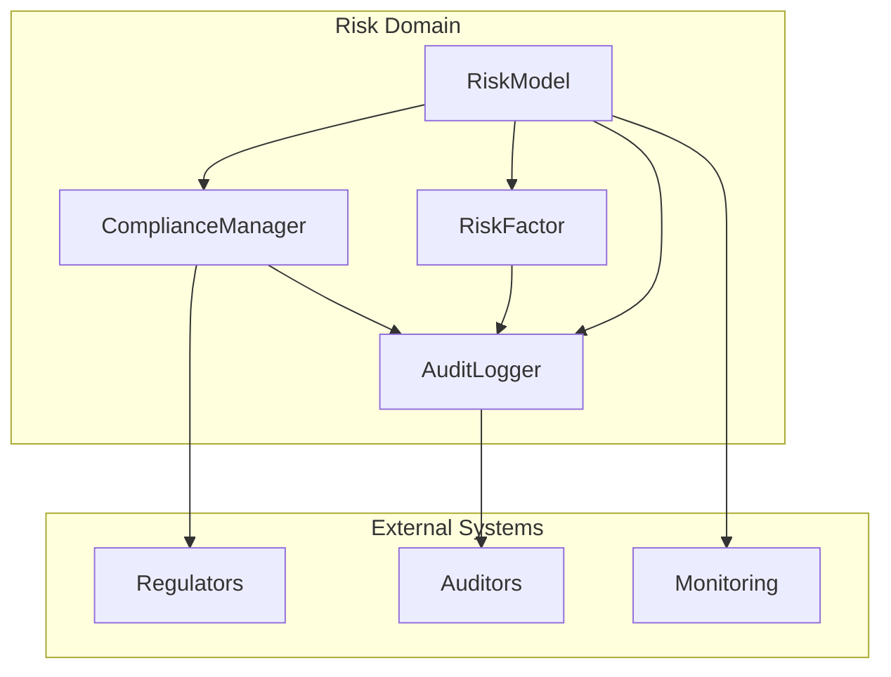
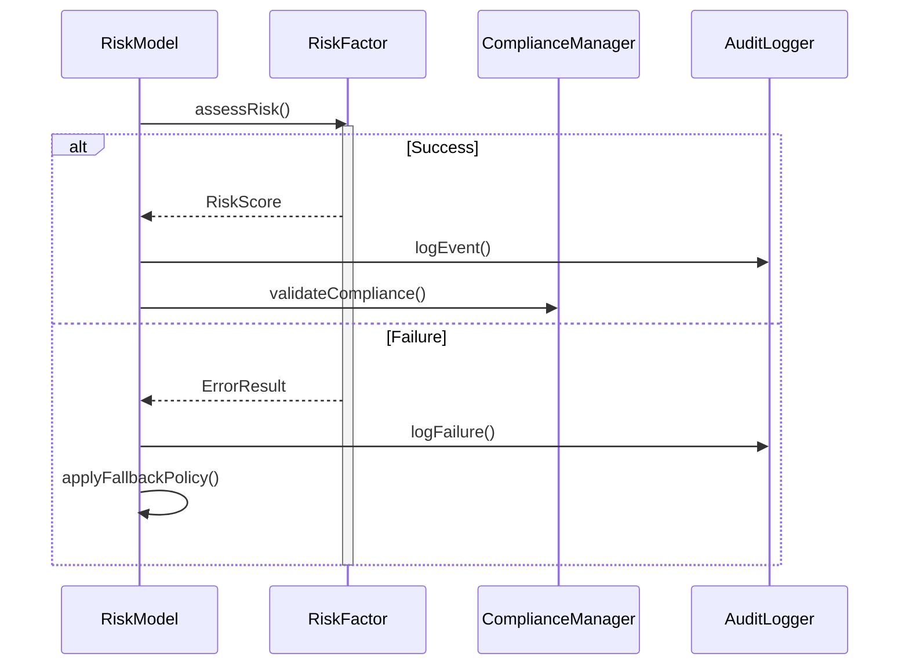
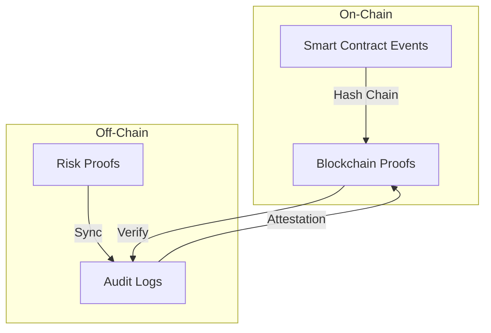

# VeritasVault Risk Domain Documentation - Part 1

---

## Metadata Block

yaml
document_type: architecture
classification: internal
status: draft
version: 1.0.0
last_updated: 2025-05-24
applies_to: risk-domain
dependencies:
  - core-infrastructure-v2.1
  - security-framework-v1.5
  - compliance-model-v1.2
reviewers:
  - risk-architecture-board
  - domain-experts
  - security-team-lead
next_review: 2025-06-24
priority: p0

## 2. Domain Model & Responsibilities

### A. Risk & Compliance Domain

#### 1. RiskModel

**Purpose**: Centralized risk engine for real-time and scheduled analysis.

**Key Responsibilities**:

- Calculate, aggregate, and store risk metrics and scores
- Enforce up-to-date risk policies (parameterized)
- Orchestrate multi-factor, cross-domain assessment workflows
- Maintain, version, and audit all deployed risk models

#### 2. RiskFactor

**Purpose**: Componentized analyzer for individual risk sources.

**Key Responsibilities**:

- Analyze/score all market risks (volatility, price feeds, slippage)
- Evaluate credit/counterparty risk (exposure, creditworthiness, default probability)
- Assess oracle/third-party risks (source reliability, update lag)
- Monitor contract risks (upgrades, bugs, permission abuse, composability threats)

#### 3. ComplianceManager

**Purpose**: Regulatory compliance engine and reporting coordinator.

**Key Responsibilities**:

- Generate and schedule compliance/attestation reports
- Maintain full audit trails and exportable reports for all activity
- Enforce regulatory, KYC/AML, and internal rules (configurable)
- Manage ongoing, periodic, and ad-hoc reporting schedules

#### 4. AuditLogger

**Purpose**: Immutable, cryptographic audit log and proof system.

**Key Responsibilities**:

- Append-only event logs (all critical operations)
- Generate signed attestations for audit events
- Provide cryptographically verifiable proofs to auditors/regulators
- Archive and manage historical data with tamper-proof retention

## Implementation Details

### Domain Interfaces

```typescript
interface IRiskModel {
  assessRisk(target: Target): Promise<RiskAssessment>;
  updatePolicy(policy: RiskPolicy): Promise<void>;
  getAssessmentHistory(target: Target): Promise<RiskAssessment[]>;
}

interface IRiskFactor {
  evaluateRisk(source: RiskSource): Promise<RiskScore>;
  updateFactorWeights(weights: FactorWeights): Promise<void>;
  getFactorHistory(source: RiskSource): Promise<RiskScore[]>;
}

interface IComplianceManager {
  generateReport(type: ReportType): Promise<ComplianceReport>;
  enforceRules(target: Target): Promise<ComplianceResult>;
  updateRules(rules: ComplianceRules): Promise<void>;
}

interface IAuditLogger {
  logEvent(event: AuditEvent): Promise<void>;
  generateProof(eventId: EventId): Promise<CryptographicProof>;
  verifyProof(proof: CryptographicProof): Promise<boolean>;
}
```

## Implementation Patterns

### Solidity Interface Examples

```solidity
interface IRiskModel {
    struct RiskAssessment {
        bytes32 id;
        uint256 riskScore;
        bytes32[] factors;
        uint256 timestamp;
        bytes evidence;
    }

    function assessRisk(bytes32 targetId) external returns (RiskAssessment memory);
    function updateRiskPolicy(bytes32 policyId, bytes calldata policy) external;
    function getRiskHistory(bytes32 targetId) external view returns (RiskAssessment[] memory);
}

interface IAuditLogger {
    function logEvent(
        bytes32 eventType,
        bytes calldata data,
        bytes calldata signature
    ) external returns (bytes32);
    
    function verifyAuditTrail(bytes32 eventId) external view returns (bool);
    function getAuditProof(bytes32 eventId) external view returns (bytes memory);
}
```

## Deployment Strategy

### Phase 1: Core Risk Infrastructure (Weeks 1-3)

- Deploy AuditLogger with immutable storage configuration
- Implement base RiskFactor components for market and counterparty risks
- Create foundational RiskModel with core assessment capabilities
- Deploy essential objects and events:
  - Objects: RiskAssessment, RiskPolicy, AuditRecord, RiskFactor
  - Events: RiskAssessmentCreated, PolicyUpdated, AuditLogCreated, FactorEvaluated

### Phase 2: Compliance & Reporting (Weeks 4-6)

- Deploy ComplianceManager with configurable rule engine
- Implement scheduled reporting infrastructure
- Integrate regulatory reporting templates
- Deploy additional objects and events:
  - Objects: ComplianceRule, ComplianceReport, ReportTemplate, RuleViolation
  - Events: RuleViolated, ReportGenerated, ComplianceStatusChanged, RuleUpdated

## Security & Threat Considerations

| Threat Type             | Vector/Scenario                  | Mitigation/Control                             |
| ----------------------- | -------------------------------- | ---------------------------------------------- |
| Risk Model Evasion      | Manual overrides, hidden flows   | Immutable logs, signed attestations            |
| Audit Tampering         | Log manipulation, silent edit    | Append-only, cryptographic proofs, access logs |
| Compliance Gaps         | Out-of-date rules, missed events | Policy versioning, automated triggers          |
| Data Retention Failure  | Silent deletes, selective loss   | Tamper-proof storage, regular audits           |

## Integration Points

- Risk and audit logs integrated with core infrastructure
- ComplianceManager accessible to external regulators
- Reports exportable in multiple formats (PDF, JSON, XBRL)
- Real-time event streaming to monitoring systems

# VeritasVault Risk Domain Documentation - Enhancements

## Component Relationships & Data Flow



## Domain Event Flow & Error Handling



## Error Handling Patterns

```typescript
interface ErrorResult {
  code: ErrorCode;
  severity: ErrorSeverity;
  retryable: boolean;
  context: ErrorContext;
  timestamp: DateTime;
}

interface FaultTolerance {
  readonly maxRetries: number;
  readonly backoffStrategy: BackoffStrategy;
  readonly circuitBreakerConfig: CircuitBreakerConfig;
  
  handleError(error: ErrorResult): Promise<void>;
  applyFallbackPolicy(): Promise<void>;
  notifyStakeholders(error: ErrorResult): Promise<void>;
}
```

## Regulatory Standards Mapping

| Component | Standard | Requirement | Implementation |
|-----------|----------|-------------|----------------|
| AuditLogger | SEC 17a-4 | Immutable Records | Append-only logs with cryptographic proofs |
| ComplianceManager | MiCA Article 30 | Risk Monitoring | Real-time assessment and reporting |
| RiskModel | ISO 31000 | Risk Framework | Structured assessment methodology |
| RiskFactor | Basel III | Risk Categories | Modular risk source analysis |

## Deployment Success Criteria

### Phase 1: Core Infrastructure
- **Success Metrics:**
  - Risk assessment completion < 5 seconds
  - 100% audit log coverage
  - Zero data loss on component failure
- **Rollback Triggers:**
  - Assessment latency > 10 seconds
  - Audit log inconsistency
  - Component unavailability > 5 minutes

### Phase 2: Compliance & Reporting
- **Success Metrics:**
  - Report generation < 30 seconds
  - Real-time compliance status
  - All regulatory exports validated
- **Rollback Triggers:**
  - Failed regulatory export
  - Compliance rule processing delay > 1 minute
  - Report generation failure

## Event Reconciliation



## Upgrade & Migration Patterns

```typescript
interface UpgradeableContract {
  readonly version: string;
  readonly upgradeHistory: UpgradeRecord[];
  
  prepareUpgrade(): Promise<void>;
  validateState(): Promise<boolean>;
  migrateData(newSchema: Schema): Promise<void>;
  rollbackUpgrade(): Promise<void>;
}
```

This enhancement package addresses the key improvements suggested in the evaluation:

1. Visual representation of component relationships
2. Explicit error handling patterns
3. Regulatory standard mappings
4. Clear success criteria and rollback triggers
5. On-chain/off-chain event reconciliation
6. Upgrade and migration patterns
